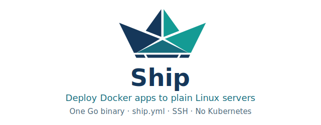

<p align="center">
  
</p>

The model is Kamal-like: you define host pools, services, and accessories in YAML, provision machines through a cloud provider (or point Ship at hosts you already have), install a small agent over SSH, and roll out releases with health checks and rollback.

## What you get

- A single `ship` binary for provision, deploy, scale, logs, and recovery
- YAML config with per-environment overrides
- Cloud provisioning for Hetzner, Vultr, DigitalOcean, Linode, AWS, GCP, Azure, and [others](docs/configuration/providers/README.md)
- Inventory-backed targets through Terraform, Pulumi, Ansible, OpenSSH config, or manual host lists
- SSH-framed agent RPC (no open agent port on the host)
- Deterministic placement across host pools
- Managed Caddy ingress with TLS, redirects, and upstream health checks
- Encrypted secrets, accessories with backup/restore, and release rollback

## Install

Requires [Go](https://go.dev/dl/) 1.26+ and Docker for deploys.

Install the CLI with `go install`:

```bash
go install github.com/watzon/ship/cmd/ship@latest
```

Pin a branch or tag with `@main` (or `@v0.1.0` once releases are tagged) instead of `@latest`.

Working from a clone:

```bash
git clone https://github.com/watzon/ship.git
cd ship
go install ./cmd/ship
```

Ensure `$(go env GOPATH)/bin` is on your `PATH` (or set `GOBIN`), then verify:

```bash
ship --help
ship version
```

## First deploy

```bash
ship init
# edit ship.yml
ship doctor
ship --dry-run provision apply production
ship --dry-run deploy production
```

Set your provider credentials, run `ship provision apply` and `ship agent install`, then `ship deploy`. The [quick start guide](docs/quickstart.md) walks through secrets, registry auth, and the full command sequence.

> [!TIP]
> Run mutating commands with `--dry-run` first. Start with `ship doctor` and `ship provision plan` before touching real infrastructure.

## Documentation

| Guide | What it covers |
| --- | --- |
| [Quick start](docs/quickstart.md) | End-to-end setup from a blank repo |
| [Configuration](docs/configuration/README.md) | `ship.yml` reference, SSH, pools, labels |
| [Providers](docs/configuration/providers/README.md) | Per-cloud YAML examples and credentials |
| [Deploy and operate](docs/deploy-and-operate.md) | Rollouts, ingress, hooks, accessories, day-2 ops |
| [Recovery](docs/recovery.md) | Failed deploys, rollbacks, accessory restore |
| [Development](docs/development.md) | Running tests and acceptance gates |
| [Adding a provider](docs/providers.md) | Provider implementation contract |

## Development

```bash
go test ./...
go build ./cmd/ship
```

See [development](docs/development.md) for optional live and integration test gates.