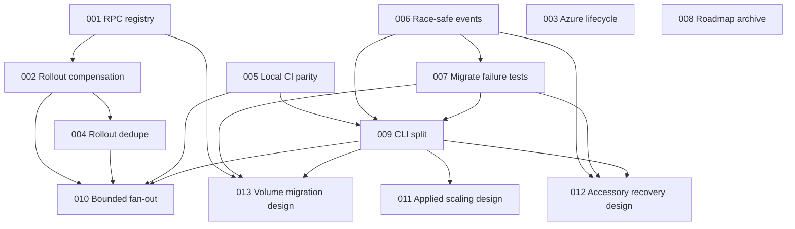

# Ship improvement plans

These plans were produced from a standard, hotspot-weighted audit of commit `93da974` on 2026-07-16. The audit covered correctness, security, performance, tests, architecture, dependencies, developer tooling, documentation, and product direction. The user selected every vetted finding and direction option for planning.

Each plan is self-contained for a fresh executor. Run its drift check first, obey its scope and STOP conditions, and update the status table below after execution/review.

## Verification baseline

Observed at `93da974` before plan writing:

| Gate | Result |
|---|---|
| `go mod verify` | pass; all modules verified |
| `gofmt -l .` | pass; no files printed |
| `go vet ./...` | pass |
| `go test -race ./...` | pass; 43 packages, 2 with no tests |
| `go run golang.org/x/vuln/cmd/govulncheck@latest ./...` | no called vulnerabilities; 14 vulnerabilities only in unreachable dependency code |

Plan 005 makes the full CI/release gate set available through one local command. Plans that depend on it must use that command rather than a reduced `go test`/`go build` check.

## Status

Allowed values: `TODO`, `IN PROGRESS`, `BLOCKED`, `DONE`, `STALE`. `DONE` means the plan's done criteria were independently checked, not merely implemented.

| Plan | Priority | Category | Effort | Risk | Status | Depends on |
|---|---:|---|---:|---:|---|---|
| [001 — Agent RPC registry](001-agent-rpc-registry.md) | P1 | Architecture / correctness prevention | S | LOW | DONE | — |
| [002 — Rollout compensation](002-compensate-failed-rollouts.md) | P1 | Correctness | L | HIGH | DONE | 001 |
| [003 — Azure lifecycle operations](003-azure-lifecycle-operations.md) | P1 | Correctness | M | MED | DONE | — |
| [004 — Deduplicate rollout host work](004-deduplicate-rollout-host-work.md) | P1 | Performance | S | LOW | DONE | 002 |
| [005 — Local CI parity](005-local-ci-parity.md) | P1 | DX / tooling | S | LOW | DONE | — |
| [006 — Visible, race-safe events](006-visible-race-safe-events.md) | P2 | Correctness / observability | S | LOW | DONE | — |
| [007 — Migrate failure contracts](007-migrate-failure-contracts.md) | P1 | Test coverage | M | MED | DONE | 006 |
| [008 — Archive stale V1 roadmap](008-archive-stale-v1-roadmap.md) | P2 | Documentation | S | LOW | DONE | — |
| [009 — Split CLI command domains](009-split-cli-command-domains.md) | P2 | Architecture | L | MED | DONE | 005, 006, 007 |
| [010 — Bounded host fan-out](010-bounded-host-fanout.md) | P3 | Performance | L | MED | TODO | 002, 004, 005, 009 |
| [011 — Applied scaling design spike](011-applied-scaling-design-spike.md) | Direction | Product design | M | MED | DONE | 009 |
| [012 — Stale accessory recovery design](012-stale-accessory-recovery-design.md) | Direction | Recovery design | M | HIGH | DONE | 006, 007, 009 |
| [013 — Service volume migration design](013-service-volume-migration-design.md) | Direction | Data-mobility design | L | HIGH | DONE | 001, 007, 009 |

## Recommended execution order

Dependency order governs. Plans in the same wave have disjoint or read-only scopes and may run in parallel in isolated worktrees; do not run plans that edit overlapping files concurrently.

### Wave 1 — independent foundations

- **001**: centralize RPC method registration before rollout recovery or a future migration protocol adds methods.
- **003**: correct Azure asynchronous lifecycle behavior; provider-local and independent.
- **005**: establish local CI parity before large refactors.
- **006**: serialize event writes and expose failures before failure-path test work.
- **008**: archive stale roadmap claims; documentation-only and independent.

### Wave 2 — highest-risk behavior and characterization

- **002** after 001: add rollout compensation and independently review every failure boundary.
- **007** after 006: lock down migration residual-state contracts before moving CLI code or designing data mobility.

Do not execute 002 and 007 in the same worktree concurrently: both may touch CLI/deployment test infrastructure.

### Wave 3 — safe optimization on corrected behavior

- **004** after 002: deduplicate image pulls/network ensures without obscuring compensation order.

### Wave 4 — structural cutover

- **009** after 005, 006, and 007: split `internal/cli/root.go` and its test file by command domain. Rebase it after earlier CLI changes; keep it move-only.

### Wave 5 — measured optimization and optional direction work

- **010** after 002, 004, 005, and 009: add bounded parallelism only to independent host phases, with benchmark evidence.
- **011** after 009: decide durable applied-scaling semantics; design artifact only.
- **012** after 006, 007, and 009: design stale accessory recovery/fencing; design artifact only.
- **013** after 001, 007, and 009: design opt-in service-volume migration; design artifact only.

Plans 011–013 do not authorize product implementation. Each ends in a machine-readable design verdict; create a separate implementation plan only after that verdict is reviewed.

## Dependency graph

## Vetted findings mapped to plans

| Audit rank | Finding | Evidence at planning commit | Plan |
|---:|---|---|---|
| 1 | A failed fixed-port rollout can leave old capacity stopped while release metadata still points to the previous release. | `internal/deployment/deployment.go:209-258,443-523`; deploy failure path in `internal/cli/root.go` | 002 |
| 2 | Azure accepts long-running deletes and companion-resource cleanup, but client code treats HTTP 202 as completion and discards cleanup failures. | `internal/provider/azure/azure.go:226-239,398-454`; fake API in `azure_test.go` | 003 |
| 3 | Agent RPC dispatch and protocol negotiation maintain separate method lists, allowing one-sided additions. | `internal/agent/rpc.go:374-518,1224-1256` | 001 |
| 4 | Per-placement pulls and network ensures repeat identical one-shot work on hosts running multiple replicas/services. | `internal/deployment/deployment.go:189-208,228-242,453-474,786-790` | 004 |
| 5 | Local guidance omits CI/release formatting, vet, race, module, vulnerability, and release-build gates. | `.github/workflows/ci.yml`; `.github/workflows/release.yml`; `docs/development.md`; `skills/ship/SKILL.md` | 005 |
| 6 | Event read-modify-write is unlocked and CLI callers silently discard persistence errors. | `internal/state/state.go:382-412`; `internal/cli/root.go:1457-1463` | 006 |
| 7 | Host migration lacks injected failure tests across create, bootstrap, accessory move, fact repoint, rollout, and old-server deletion. | `internal/cli/migrate.go:70-211`; existing `migrate_test.go` and acceptance tests | 007 |
| 8 | Root V1 checklist reports shipped deploy, ingress, rollback, and accessory work as incomplete. | `PLAN.md:258-383` versus deployment/agent/CLI implementation | 008 |
| 9 | One 7,410-line CLI file and one 7,248-line test file own nearly every operator workflow. | `internal/cli/root.go`; `internal/cli/root_test.go`; focused `migrate.go` exemplar | 009 |
| 10 | Independent host inspection/preflight/sync phases serialize one-shot SSH handshakes. | `internal/agent/client.go:34-64`; `internal/deployment/deployment.go:155-169`; CLI host loops | 010 |

## Direction options

Direction work is intentionally separated from defect priority:

| Option | Current gap | Plan |
|---|---|---|
| Applied scale | `ship scale` mutates only an in-memory config and prints a plan; durable scaling requires editing YAML and deploying. | 011 |
| Stale accessory recovery | A saved host leaving the pool blocks restore/failover with “failover is not implemented”; automatic movement would risk split brain. | 012 |
| Service-volume migration | `ship migrate` explicitly warns that service volume data is not moved. | 013 |

## Considered and rejected

These items were investigated and intentionally not planned. Re-audit only if the cited boundary changes.

- **Quote `#` or shell characters in Docker env-file values** — rejected as a false positive. Docker's `kvfile` parser preserves inline `#`, spaces, equals signs, and quote characters literally; shell quoting would corrupt values.
- **Allowlist agent RPC filesystem paths as a standalone security fix** — rejected. RPC already runs through the configured SSH account, which can execute arbitrary remote commands; this is not a distinct privilege boundary without a future network daemon or restricted command mode.
- **Treat generated encrypted secret files as plaintext secret leaks** — rejected. Remote files contain ciphertext, are written mode `0600`, and are not logged. Revisit only if plaintext rendering reaches disk.
- **Ban arbitrary SSH options or `StrictHostKeyChecking=accept-new`** — rejected. These are documented operator-controlled settings; strict known-host pinning is available through `known_hosts_file`.
- **Replace provider selection with one reflection-heavy mega-registry** — rejected for now. It would risk config/provider import cycles and a large provider blast radius; the concrete lifecycle issue is handled by Plan 003.
- **Split `config.go` immediately** — rejected as lower leverage than the CLI split. Config is large but cohesively schema/validation focused and has less active control-flow churn.
- **Upgrade Go or dependencies solely because newer releases exist** — rejected. The audited module verifies, vet/tests pass, and `govulncheck` found no called vulnerabilities.

## Audit boundaries

Not audited in this standard pass:

- opt-in live or destructive Hetzner tests;
- the local Docker registry integration gate;
- real cloud accounts or every provider implementation line by line;
- checked-in binary/assets and visual branding;
- production fleet performance measurements;
- external DNS, registry, or SSH infrastructure outside this repository.

The audit was hotspot-weighted across all nine requested categories, with very thorough correctness/security passes and medium depth elsewhere. Low-confidence speculative items were excluded rather than converted into plans.

## Executor update protocol

After working a plan:

1. Update its status row to `IN PROGRESS`, `BLOCKED`, or `DONE`.
2. If blocked, add one short note below the table with the exact STOP condition and evidence; do not weaken the plan.
3. Mark `DONE` only after every done criterion and verification command passes.
4. If drift invalidates scope or excerpts, mark `STALE` and write a replacement plan with a new monotonic number; do not silently rewrite completed history.
5. Direction plans produce reviewed design artifacts, not implementation code.